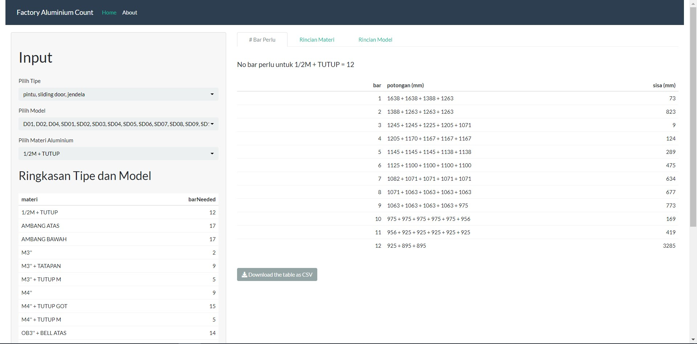
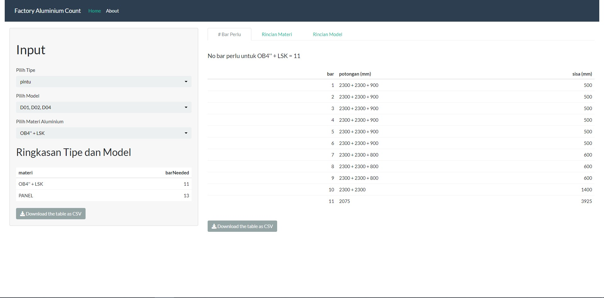
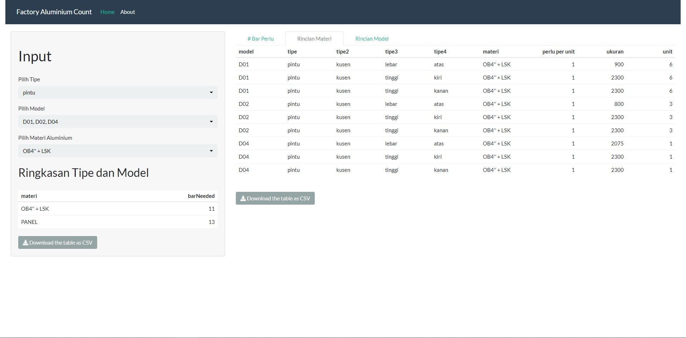

# Pak Tu Lay Doors - Materials Needed

View the google sheet [here](https://docs.google.com/spreadsheets/d/1Fwp5bj1Q6TyonGrFc_UbmCjGx5BnOrHNWFhvGsx0-A0/edit?usp=sharing)

Go to this [link](https://dvannanda.github.io/paktulay-doors/#Legend) for explanation and code. 

## Shiny Demo

